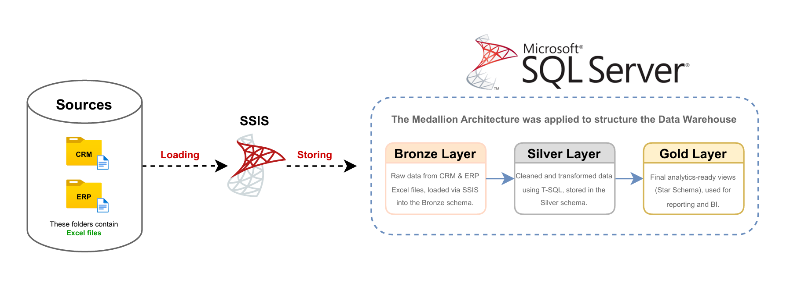

# Unified Sales Warehouse

A full-stack data warehouse solution designed to integrate and analyze business sales data from CRM and ERP systems. The project leverages the **Medallion Architecture** to organize data into distinct layers for traceability, quality, and analytical readiness.

---

## Data Flow Architecture

  

This architecture illustrates the movement of data from **raw Excel files** to an analytical-ready **Star Schema** model.

---

## 🗂️ Data Sources

- **CRM System:** Provides sales, customer, and product information.
- **ERP System:** Provides additional customer info, product categories, locations, and attributes.
---

## 🔄 ETL Pipeline – SSIS + SQL Server

The data is processed through three distinct layers using a combination of **SSIS packages**, **stored procedures**, and **T-SQL scripts**:

---

### 🟫 Bronze Layer – Raw Zone

- Raw data from CRM & ERP Excel files.
- Loaded into SQL Server using **SSIS**.
- Stored in a schema called `bronze`.
- Tables include:
  - `crm_sales_details`
  - `crm_cust_info`
  - `crm_prd_info`
  - `erp_cust_az12`
  - `erp_loc_a101`
  - `erp_px_cat_g1v2`

---

### 🟪 Silver Layer – Cleansed & Transformed

- Data is copied from Bronze using `TRUNCATE + INSERT INTO` via **stored procedures**.
- Business rules and data transformations are applied using **T-SQL**.
- Stored in schema `silver`.
- Standardization of data types, removal of duplicates, and relational joins are applied.
- Same tables exist with cleaned content:
  - `crm_sales_details`
  - `crm_cust_info`
  - `crm_prd_info`
  - `erp_cust_az12`
  - `erp_loc_a101`
  - `erp_px_cat_g1v2`

---

### 🟨 Gold Layer – Analytics & Star Schema

- Final analytical views are created in the `gold` schema.
- Data is modeled using **Star Schema** (Sales Data Mart).
- No physical tables: all are **SQL views** for performance and flexibility.
- The model includes:
  - **Fact Table**: `fact_sales`
  - **Dimension Tables**: `dim_customers`, `dim_products`

---

## ⭐ Star Schema – Sales Data Mart

### 📌 `gold.dim_customers`
| Column Name     | Description                    |
|-----------------|--------------------------------|
| **PK** customer_key | Surrogate primary key         |
| customer_id     | ID from source system           |
| customer_number | Business identifier             |
| first_name      | Customer first name             |
| last_name       | Customer last name              |
| gender          | Male / Female                   |
| birthdate       | Date of birth                   |
| marital_status  | Single / Married                |
| country         | Customer's country              |

---

### 📌 `gold.dim_products`
| Column Name     | Description                        |
|-----------------|------------------------------------|
| **PK** product_key | Surrogate primary key             |
| product_id      | Source system ID                   |
| product_number  | Product code                       |
| product_name    | Product name                       |
| category_id     | ID of product category             |
| category        | Product category name              |
| subcategory     | Product subcategory name           |
| maintenance     | Maintenance required (Yes / No)    |
| cost            | Product base cost                  |
| product_line    | Business product line              |
| start_date      | Availability start date            |

---

### 📌 `gold.fact_sales`
| Column Name     | Description                        |
|-----------------|------------------------------------|
| order_number    | Sales order number                 |
| **FK1** product_key | Reference to `dim_products`       |
| **FK2** customer_key| Reference to `dim_customers`     |
| order_date      | Date of placing order              |
| shipping_date   | Product shipping date              |
| due_date        | Delivery due date                  |
| sales_amount    | Total revenue for the order        |
| quantity        | Quantity sold                      |
| price           | Unit price                         |

---

## 🧮 Sales Metrics

The warehouse supports calculation of key sales KPIs:

- **Sales Amount**: `price × quantity`
- **Total Quantity Sold**
- **Average Order Value**
- **Sales by Product Line**
- **Customer Segmentation**

---

## Project Highlights

- Source files: Excel (from CRM & ERP)
- ETL tool: SSIS (SQL Server Integration Services)
- DBMS: SQL Server 2019
- Business Logic: Implemented via T-SQL stored procedures
- Data Model: Star Schema (Views in Gold Layer)
---

